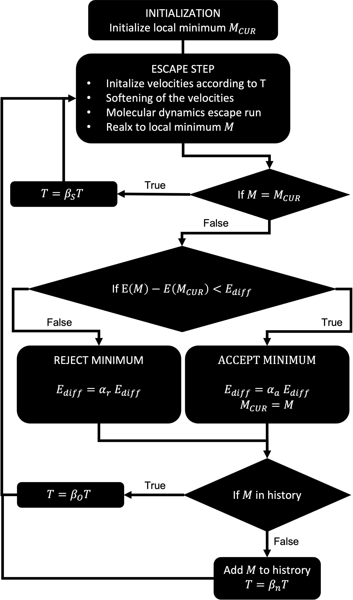

Theory
++++++

Introduction
------------
The minima hopping algorithm makes use of the Bell–Evans–Polanyi principle for global structure optimization. The
algorithm is exploring the configurational space as fast as possible and is avoiding revisiting already known parts of
the space. A flowchart of the minima hopping algorithm can be found below:

Technical details
-----------------

Softening
~~~~~~~~~
Before the MD run starts, the velocities are aligned approximately along the softest modes of the current local minimum. 
This procedure has several advantages:

#. High frequencies are eliminated and, hence, a larger time step can be taken which reduces the number of MD steps and therefore the computational cost.
#. The dynamics is biased to global movements so that larger distances in the configurational space are covered.
#. The probability of crossing a low energy barrier is higher. 

MD run
~~~~~~
The molecular dynamics run in the escape step is performed with the velocity Verlet algorithm. If the system is bulk a
variable cell shape MD is performed where also the cell is moved during the MD.

Fragmented Clusters
~~~~~~~~~~~~~~~~~~~
Doing MD with clusters at high temperature can lead to its fragmentation. This is not desired in global optimization since the global optimum is not fragmented.
Therefore we implemented DBSCAN which is checking if a cluster is fragmented during the MD. If this is the case the velocities are aligned for each cluster towards
the center of mass. This enables to fix the cluster fragmentation during the MD. Furthermore, it is ensured that the MD is not stopped with a fragmented cluster.

Distinguishing Structures
~~~~~~~~~~~~~~~~~~~~~~~~~
As it can be observed from the flowchart, structure distinction is a crucial part in the minima hopping algorithm. In
earlier versions this task has been done by comparing energies of structures. However, due to noise in energies and the
fact that two different structures can have the same or very similar energies this is not a well defined observable for
distinguishing structures. Therefore here this task is performed by using the Overlap Matrix Fingerprint.

Feedback
--------

MD time step
~~~~~~~~~~~~
The initially given MD time step dt is adjusted automatically after each MD according to the energy conservation. 
If the energy conservation is not deviating by more than 2% the time step is increased and decreased otherwise.

Temperature
~~~~~~~~~~~
If a minimum has been found more than once the temperature is increased by :math:`\beta_{increase}`. There a so called 
enhanced feedback can be used which increases the temperature faster than the normal feedback. Instead of adjusting the temperature
according to 

.. math::
   T = \beta_{increase} * T 

the energy is adjusted depending on the number of times a minimum has already been visited

.. math::
   T = T * \beta_{increase} * (1 + ln(n_{visits})).

This is particularly useful for finding the global minimum of systems with a multi funnel potential energy surface e.g LJ75. 
However, while the global minimum is found faster it can happen that one funnel is explored less because the algorithm is pushing 
the system faster towards other funnels.

:math:`E_{diff}`
~~~~~
If a minimum is rejected :math:`E_{diff}` is increased by a factor :math:`\alpha_{rejected}`. Also here the enhanced feedback is applied if it is for the temperature.
Instead of adjusting :math:`E_{diff}` according to 

.. math::
   E_{diff} = \alpha_{rejected} * E_{diff}, 

it is also adjusted depending on the number of times a minimum has already been visited

.. math::
   E_{diff} = E_{diff} * \beta_{increase} * (1 + ln(n_{visits})).

