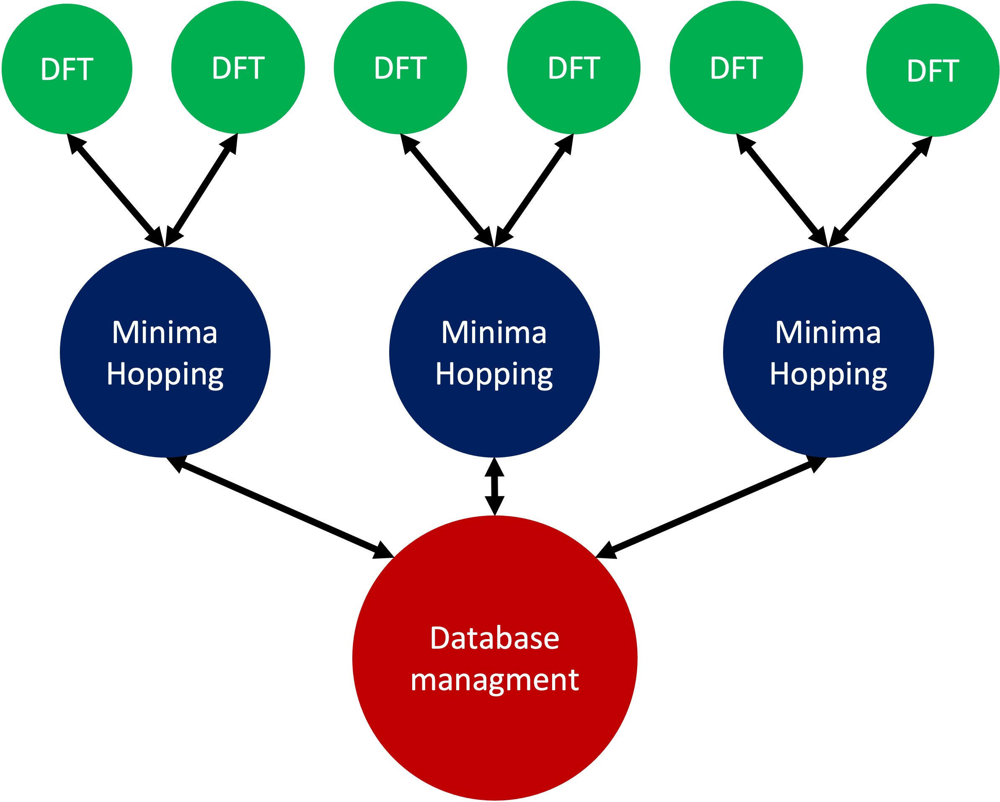

Minima Hopping Tutorial
+++++++++++++++++++++++
This tutorial gives a brief overview how to run the minima hopping algorithm. A sodium 13 cluster is examined using the
`eam calculator <https://wiki.fysik.dtu.dk/ase/ase/calculators/eam.html#module-ase.calculators.eam>`_ implemented in
ASE. To use this calculator a parameter file is needed. This file can be downloaded the following way:
.. code-block::

    wget https://www.ctcms.nist.gov/potentials/Download/2016--Nichol-A-Ackland-G-J--Na/3/Na_v2.eam.fs

Exercice 1: Distinguishing minima
---------------------------------
The aim of this tutorial is to determine the fingerprint distance of structures which can be considered to be the same
and structures which are different. The idea is to perform various MD trajectories and relax them back to the same
local minimum with a certain force norm. To do this task the package includes a class `adjust_fp` which is doing this
task automatically. First we need all the imports which are required:

.. code-block:: python

    from minimahopping.adjust_fp import adjust_fp
    from ase.calculators.eam import EAM
    from ase.cluster import Icosahedron

Now we read a structure and set up a calculator. In this example we read the structure of a Lennard-Jones cluster and
we set up the corresponding calculator:

.. code-block:: python

    atoms = Icosahedron('Na', 2, latticeconstant=None)
    calculator = EAM(potential="Na_v2.eam.fs")
    atoms.calc = calculator

Afterwards we set up the adjustment class.

.. code-block:: python

    fnrm =  0.001
    adjust = adjust_fp(initial_configuration=atoms,
                   iterations=10,
                   T0=100,
                   dt0=0.01,
                   mdmin=1,
                   n_S_orbitals=1,
                   n_P_orbitals=1,
                   width_cutoff=4,
                   fmax=fnrm,
                   write_graph_output=False)

Now we run 100 mds followed by a geometry optimization.

.. code-block:: python

    outdict = adjust.run()

A dictionairy containing all the information is returned and can be printed the following way:

.. code-block:: python

    msg = "\n=======================FINGERPRINT================================\n"
    msg += '\nMaximal fingerprint distance between the same local minima:\n' + str(fp_max)
    msg += '\n Mean fingerprint distance between the same local minima:\n' + str(fp_mean)
    msg += '\n Standard deviaton of the fingerprint distances:\n' + str(fp_std)
    msg += '\n Suggested minimum threshold (mean + 3 * std):\n' + str(fp_mean + 3 * fp_std)
    msg += "\n==================================================================\n"
    print(msg)

    e_max = outdict['energy']['max']
    e_mean = outdict['energy']['mean']
    e_std = outdict['energy']['std']
    msg = "\n=========================ENERGIES=================================\n"
    msg += '\nMaximal difference between the same local minima:\n' + str(e_max)
    msg += '\n Mean energy difference between the same local minima:\n' + str(e_mean)
    msg += '\n Standard deviaton of the energy differences:\n' + str(e_std)
    msg += '\n Suggested energy threshold (mean + 3 * std):\n' + str(e_mean + 3 * e_std)
    msg += "\n==================================================================\n"
    print(msg)


.. note::
    Be aware that it is very important to use the same parameters for the calculation of the energy and force, the OMFP and the local geometry optimization in the Minima Hopping method.


Exercise 2: Starting Minimahopping
----------------------------------

The aim of this tutorial is to start the minima hopping algorithm with the given default settings. If you want to use
different parameters you can find a detailed description of them :doc:`here <parameters>`. First all the required
classes are imported:

.. code-block:: python

    from ase.calculators.eam import EAM
    from minimahopping.minhop import Minimahopping
    from ase.cluster.wulff import wulff_construction
    import logging

Now we read a structure and set up a calculator. As in exercise 1 we read the structure of a Lennard-Jones cluster and
we set up the corresponding calculator:

.. code-block:: python

    initial_configuration = wulff_construction('Na',
                                           surfaces=[(1, 0, 0), (0, 1, 0),(0, 0, 1)],
                                           energies=[0.001, 0.001, 0.15],
                                           size=13, # maximum number of atoms
                                           structure='bcc',
                                           rounding='above')

In a next step we set up the EAM calculator

.. code-block:: python

    calculator = EAM(potential='Na_v2.eam.fs')
    initial_configuration.calc = calculator

Now we can set up the minima hopping class and run it:

.. code-block:: python

    with Minimahopping(initial_configuration,
                       verbose_output=True,
                       T0=2000, 
                       dt0=0.1,
                       use_MPI=False) as mh:

        mh(totalsteps=50)

The minima hopping algorithm cycles now through 100 escape loops.

.. note::
    If a second calculator is desired this can easily be done by setting up a second md calculator and give it as an argument to the ```MinimaHopping``` class.
    .. code-block:: python

        calculator = SOME_ASE_CALCULATOR
        md_calculator = SOME_OTHER_ASE_CALCULATOR

        with Minimahopping(initial_configuration,
                           md_calculator = md_calculator
                           verbose_output=True,
                           T0=2000, 
                           dt0=0.1,
                           use_MPI=False) as mh:

        mh(totalsteps=50)


.. caution::
    Be aware that in case you want to examine periodic systems your calculator needs the stress property included so
    that variable cell shape md and geometry optimization is possible.


Exercise 3: Graph construction
------------------------------
After the minima hopping run is finished automatically a graph can be constructured which connects all found minima to each other. 
This enables to see how many minima were found starting at one minimum as well as the transition from one minimum to another. 
First all the libararies are imported for the graph construction:

.. code-block:: python
    
    import matplotlib.pyplot as plt
    import networkx as nx
    import pydot
    import pygraphviz
    from ase.io import write
    from minimahopping.graph import graph

Then a function is defined to draw the graph:

.. code-block:: python

    def draw_pygraphviz(g, filename, layout='fdp'):
        g.graph_attr['concentrate'] = 'true'
        g.layout(layout)
        g.draw(filename)

Afterwards the minima hopping graph class is constructed with the corresponding output files and the graph is read:

.. code-block:: python

    g = graph.MinimaHoppingGraph('graph.dat', 'trajectory.dat', True)
    g.read_from_disk()


.. caution::
    In the case a single process minima hopping run is performed the corresponding files can be found in the directory
    output/restart/. In case an MPI minima hopping run is performed, the files for the graph constrution are in the directory
    /output/master/restart/.

In a next step the shortest pathway from one minimum to another is constructed. For that we need to specify the both minima for which the shortest path is to be constructed. 
The information about the exact numbers of the minima can be found in the history.dat file in the output. 

.. code-block:: python

    number_minimum1 = 0
    number_minimum2 = 2
    
    # list of minima in the path
    l = g.shortestPath(n1, n2)
    msg = 'List of minima from structure {:d} to sturucture {:d}:   {}'.format(number_minimum1, number_minimum2, l)
    print(msg)
    # structures of the path including md and geometry optimization steps
    tl = g.getTrajectoryList(n1, n2)
    # write trajectory structures to file
    write('good_trajectory.extxyz', tl, append = True)

In a last step the graph is written as a pdf where the leafs are the minima and the nodes are an MD followed by a geometry optimization. If there are to many leaves or minima respectively
it can be quite confusing so that we can removes the leafs from the traijectory and set the size of the leafs along the trajectory according to the number of leafs connected. 

.. code-block:: python

    emin, ind = g.get_lowest_energy()
    g.shift_energy_to_zero()
    stripped_graph = g.remove_leaves()
    draw_pygraphviz(nx.nx_agraph.to_agraph(stripped_graph), 'no_leaves.pdf', layout='fdp')
    draw_pygraphviz(nx.nx_agraph.to_agraph(g.graph), 'with_leaves.pdf', layout='fdp')


Exercice 4: MPI minima hopping
------------------------------
In order to use the MPI version the script looks very similar to running a single minima hopping process. 
The main difference is now that the mpi4py library has to be imported too:

.. code-block:: python

    from minimahopping.minhop import Minimahopping
    from ase.calculators.eam import EAM
    from ase.cluster.wulff import wulff_construction
    from mpi4py import MPI


Once the mpi4py library is included the whole process is the same except for the use_MPI parameter has to be set to true 
in the minima hopping constructure

.. code-block:: python

    atoms = wulff_construction('Na', surfaces=[(1, 0, 0), (0, 1, 0),(0, 0, 1)], energies=[0.001, 0.001, 0.15],
                           size=13, # maximum number of atoms
                           structure='bcc', rounding='above')
    calculator = EAM(potential="Na_v2.eam.fs")
    atoms.calc = calculator
    fnrm = 5e-3
    fingerprint_threshold = 1e-4
    with Minimahopping(atoms, fmax=fnrm, fingerprint_threshold=fingerprint_threshold, verbose_output=False, T0=2000, dt0=0.1) as mh:
        mh(totalsteps=100)


The minima hopping algorithm is now started automatically with the maximum number of MPI processes possible and each MPI process
except for one which is handling the database is performing 100 minima hopping steps.


Exercise 5: MPI minima hopping with group communicators
-------------------------------------------------------
Not only is it possible to run multiple minima hopping processes sharing one database but also each minima hopping process can have subprocesses.



This is particularly useful if an MPI parallelized code is used for evaluating energy and forces. In the example showed here the SIRIUS DFT library
is used. SIRIUS is an MPI parallelized DFT package running on both CPU and GPU written in the C++ language which can be found in the following GitHub repository:

https://github.com/electronic-structure/SIRIUS

The package can directly be interfaced with python using and ASE calculator. The python interface can be found in another GitHub repository:

https://github.com/moritzgubler/sirius-python-interface

Once SIRIUS is installed we can start with the example using group communicators. First some libraries are imported.

.. code-block:: python

    import sirius_ase.ase_simulation
    import sirius_ase.siriusCalculator
    from mpi4py import MPI
    from minimahopping.minhop import Minimahopping

Here in this example two minima hopping processes are started with and the DFT calculation is performed with 2 by 2 by 2 k-point grid. Since the DFT calculation is 
parallelized over the k-points each minima hopping process is MPI parallelized by four MPI processes. Firstly the MPI parallelization is set up:

.. code-block:: python

    numberOfMinimaHoppingProcesses = 2
    numberOfDftProcesses = 4
    globalNumberOfProcesses = numberOfMinimaHoppingProcesses + numberOfDftProcesses + 1

    comm_world = MPI.COMM_WORLD 
    rank = comm_world.Get_rank()
    size = comm_world.Get_size()

    if globalNumberOfProcesses != size:
        print('wrong number of mpi processes given to program. Expected number of processe, ', globalNumberOfProcesses)
        comm_world.Abort()
        quit()

As can be seen in the code one extra process is added for handing the database and for the comparison of structures. In a next step the groups are constructed and all 
processes with the same color will be put into one group:

.. code-block:: python

    # master group
    if rank == 0:
        color = 0
    # first group with four processes
    if rank > 0:
        color = 1
    # second group with four processes
    if rank > 4:
        color = 2

    # Checking if the group setup was successfull
    group_communicator = comm_world.Split(color, rank)
    group_rank = group_communicator.Get_rank()
    group_size = group_communicator.Get_size()

    if rank == 0:
        print('group_rank, group_size, rank, size')
    
    msg = 'group rank: {:d}   group size: {:d}  rank: {:d}  size: {:d}'.format(group_rank, group_size, rank, size)
    print(msg)

.. code-block:: python

    # read the input structure
    structfileName = 'STRUCTFILENAME'
    input_structure = ase.io.read(filename=structfileName)

    siriusJsonFileName = 'SIRIUSPYTHONFILENAME'
    # check if the file exists
    if not os.path.exists(siriusJsonFileName):
        print('json file does not exist')
        quit()
    

In a next step the SIRIUS input file is read and it is checked if all the nessecairy SIRIUS input parameters are existing

.. code-block:: python

    f = open(siriusJsonFileName)
    jsonparams = json.load(f)
    f.close()
    try:
        pp_files = jsonparams["unit_cell"]["atom_files"]
        pw_cutoff = jsonparams['parameters']["pw_cutoff"]
        gk_cutoff = jsonparams['parameters']["gk_cutoff"]
        functionals = jsonparams['parameters']['xc_functionals']
        kpoints = jsonparams['parameters']['ngridk']
        kshift = jsonparams['parameters']["shiftk"]
        if "atom_types" in jsonparams["unit_cell"]:
            jsonparams["unit_cell"].pop("atom_types")
        jsonparams["unit_cell"].pop("atom_files")
    except KeyError:
        print("required parameter was missing")
        traceback.print_exc()
        quit()


In the last step the ASE calculator is initialized for all ranks except for the master rank and afterwards minimahopping is started.
If minimahopping is finished the calculator and, hence, all MPI processes are ended.

.. code-block:: python

    try:
    # If not master rank give group comunicator to sirius calculator
        if rank != 0:
            # give the group communicator to the sirius calculator.
            calculator = sirius_ase.siriusCalculator.SIRIUS(atoms, pp_files, functionals, kpoints, kshift, pw_cutoff, gk_cutoff, jsonparams, group_communicator)
            atoms.calc = calculator

        # Start MPI Minimahopping
        with Minimahopping(atoms, Ediff0=0.5, alpha_accept=1./1.05, alpha_reject=1.05,logLevel=logging.DEBUG, verbose_output=True, mdmin=7, T0=675, dt0=0.07, use_MPI=True, fmax=0.025, collect_md_data=True, fingerprint_threshold=0.008, energy_threshold=0.1, exclude=['H']) as mh:
            mh(totalsteps=1000)

    finally:
        # make sure that not a slave slave tries to close itselve.
        if rank != 0 and group_rank == 0:
            print("Closing calculator on rank", rank, flush=True)
            atoms.calc.close()


